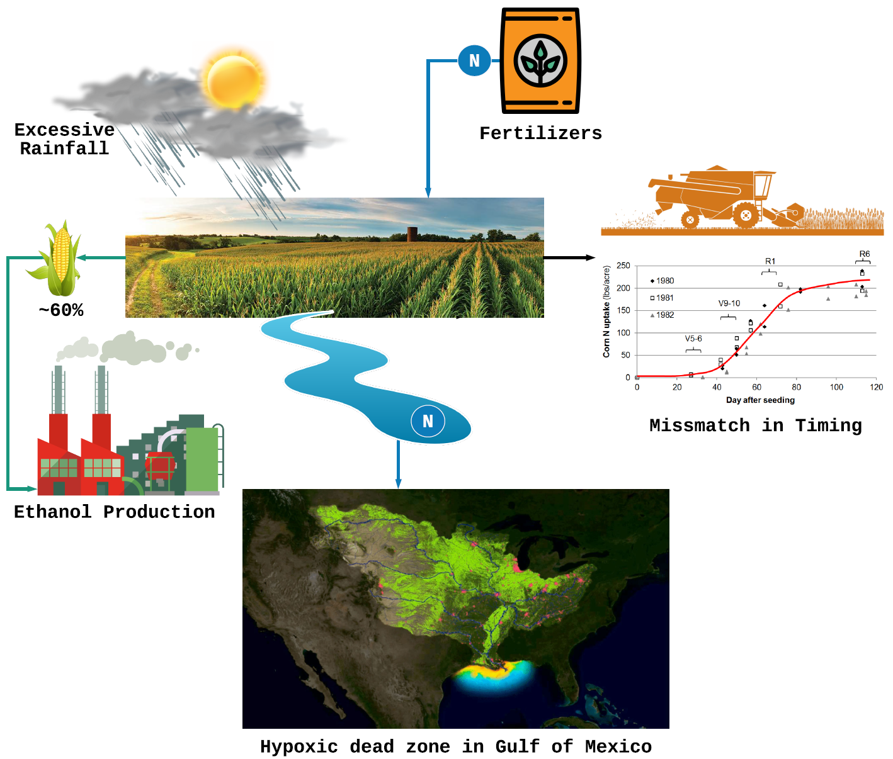

# Welcome to Iowa food-water-energy (IFEW) 





- Abundant production of corn, around 60% goes to ethanol production
- Heavy use of fertilizers to maximize crop yield
- High drainage water flux transports excess nitrogen to the Gulf of Mexico forming the hypoxic dead zone 

[Link to codes](https://github.com/raulvishal/IFEW/tree/master/Codes) 


```
Syntax highlighted code block
Things get hilighted here


# Header 1
## Header 2
### Header 3

- Bulleted
- List

1. Numbered
2. List

**Bold** and _Italic_ and `Code` text

[Link](url) and 

```  

For more details see [GitHub Flavored Markdown](https://guides.github.com/features/mastering-markdown/).

### Jekyll Themes

Your Pages site will use the layout and styles from the Jekyll theme you have selected in your [repository settings](https://github.com/raulvishal/IFEW/settings). The name of this theme is saved in the Jekyll `_config.yml` configuration file.

### Support or Contact

Having trouble with Pages? Check out our [documentation](https://docs.github.com/categories/github-pages-basics/) or [contact support](https://github.com/contact) and we’ll help you sort it out.
